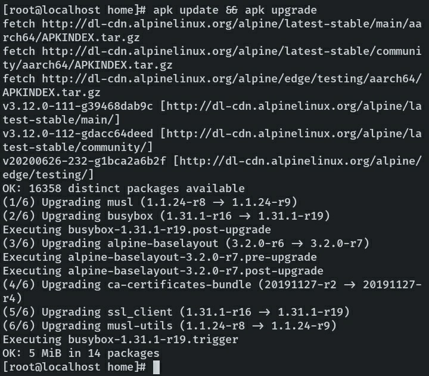
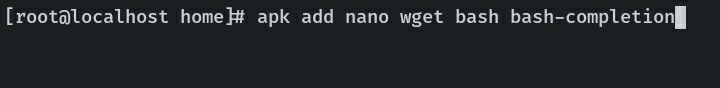
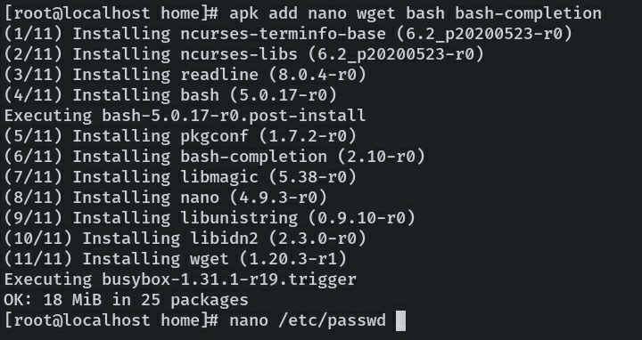
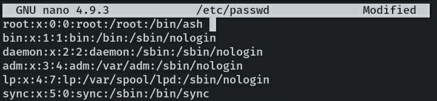
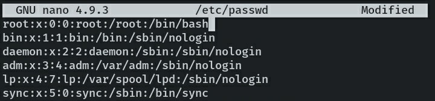
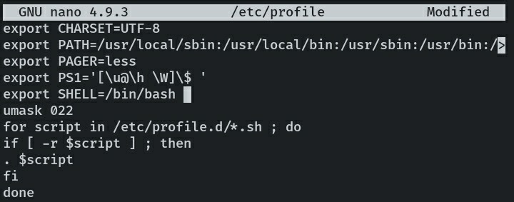
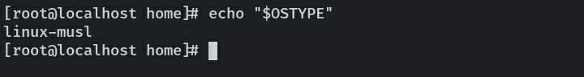
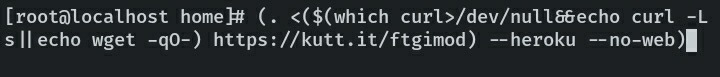
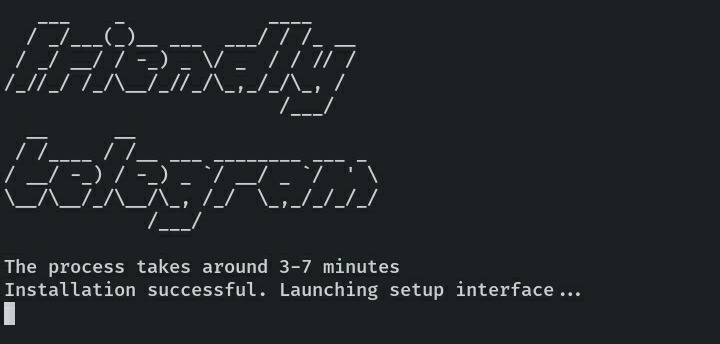
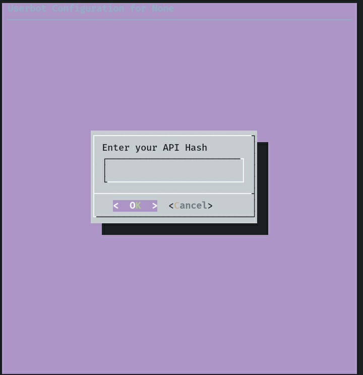

-----
- [Source code on Gitlab](https://gitlab.com/friendly-telegram)
- [Author](https://gitlab.com/hackintosh5)
-----


## Инфо
1. Это всё делалось для себя.
2. Мод предназначен для тех, кто уже пользовался юзерботом.
3. Установщик PowerShell сломан. С винды не поставите никак. Ссылка на оригинал выше.
### Изменено/Дополнено:
- Добавлена поддержка iOS на Alpine Linux iSh. 
- Кастомный звук Выключения/Включения (Windows 7).
- Фикс ошибки SSL, которая начала появляться у некоторых пользователей с Termux.
- Русифицирован процесс получения кода по Web.
- Сразу ставит регион EU (Европа, пинг 30-50мс) в Heroku прямо во время установки.
- Ставит пакет neofetch по умолчанию. В Heroku нет доступа к пакетному менеджеру apt. (!²)
- Обновляется/устанавливается из этого репозитория.
- Возможно ещё будут и другие изменения.

### !
- (!) Подробный гайд для Alpine Linux ниже. Так как устройств на iOS у меня нет, пожалуйста, отпишитесь автору/в чат о результате, если даже никаких ошибок не было. А так же ищу добровольцев для дальнейших тестов.
- (!²) На стадии доработки. У большинства встречаются проблемы с конфигами.
Если `.neofetch` не реагирует, попробуйте это:

`.terminal git clone https://github.com/dylanaraps/neofetch`
`.terminal cd n* && make PREFIX=/app/.apt/usr install`

Слетит после повторного деплоя или перезагрузки, но пока что это оптимальное решение. 
[Источник](https://github.com/dylanaraps/neofetch/issues/1371)

## Установка:

* ### Termux


	```sh
	(. <($(which curl>/dev/null&&echo curl -Ls||echo wget -qO-) https://kutt.it/ftgimod) --no-web)
	```


	Вводите APP_ID, API_HASH, номер телефона и код. Дождитесь запуска, когда напишет "Started for <id>".
	Последующие запуски -
	
	```sh
	cd $HOME/friendly-telegram && python3 -m friendly-telegram
	```

* ### На Heroku через Termux

	```sh
	(. <($(which curl>/dev/null&&echo curl -Ls||echo wget -qO-) https://kutt.it/ftgimod) --heroku --no-web)
	```

	Начальный запуск идентичный с примером выше, только в этом случае Вам потребуется ещё и API Key (ключ) с сайта Heroku.


	- Telegram App_ID и Api_hash - [Тут](https://my.telegram.org/apps)
	- Heroku Api Key - [Тут](https://dashboard.heroku.com)


* ### Alpine Linux (iPhone iSh)
	1. Обновляем список пакетов и сами пакеты.
		- $`apk update && apk upgrade`
		
	2. Скачиваем необходимые пакеты bash.
		- $`apk add bash bash-completion sudo nano`
		
	3. Используя nano (или любой другой редактор) открываем конфигурационный файл passwd в папке /etc.
		- $`nano /etc/passwd`
		
		Видим первую строку с нашем именем пользователя и путь к shell по умолчанию. В моем случае это `root`, потому что в системе нет других пользователей - 
		- `root:x:0:0:root:/root:/bin/ash`.
		
		Заменяем `ash` (иногда может быть просто`sh`) => `bash`. Получится как-то так:
		- `root:x:0:0:root:/root:/bin/bash`
		
		Сохраняем и идём дальше.
		- (! Не нужно обращаться к автору/чат поддержки с вопросами по типу _"Как редактировать?"_, _"Как сделать *что-то*_" и особенно с _"Что дальше?"_. В интернете сотни гайдов на эти темы. Пишите только в случае ошибки в самом скрипте или гайде.)
	4. Редактируем теперь /etc/profile и добавим переменную SHELL ниже остальных переменных.
		- $`nano /etc/profile` - добавим в список экспортов следующее: `export SHELL=/bin/bash`
		
	5. Закрываем консоль командой **exit** и открываем, чтобы изменения уж точно сработали.
		Проверим shell, в котором мы находимся:
		- `echo "$OSTYPE"`.
		
		Получили **linux-musl**? Успех. Идём дальше.
		А если пустота - значит где-то и что-то сделали не так. Повторите шаги 3-4.

	6. Запуск установщика
		- $`(. <($(which curl>/dev/null&&echo curl -Ls||echo wget -qO-) https://kutt.it/ftgimod) --heroku --no-web)`<br>
		Так как это iOS, с локальным сервером могут быть проблемы и вообще мало кто будет держать бот на iPhone. Поэтому ставим на Heroku.
		
		Выполняем команду и ждём, ждём, и снова ждём. 
	7. И у нас хорошие новости :)
		
	
		

	Вводим API_HASH, API_ID и Heroku API_KEY - логинимся.
	И поздравляю, мы победили Купертино.
	Проверяем `.ping` и вступаем в чат поддержки.


### Важно
- Поддержка мода & ЧаВо - https://t.me/wardsenz
- Если раньше не встречали/пользовались этим ботом, то пожалуйста, прочитайте оригинальную документацию [здесь](https://friendly-telegram.gitlab.io).
